# Отчет по лабораторной работе №2
**Дисциплина:** Операционные системы  
**Город выполнения:** г. Челябинск  

### 1. Цель работы
Изучить перенаправление потоков ввода/вывода, работу с конвейерами, особенности интерпретаторов (bash, sh, zsh, fish), а также создание алиасов и переменных окружения.

### 2. Краткая теория
* **0 (stdin)** - стандартный ввод (клавиатура).
* **1 (stdout)** - стандартный вывод (экран).
* **2 (stderr)** - вывод ошибок (экран).
* Оператор `>` перезаписывает файл, а `>>` дописывает в конец.
* Локальные переменные видны только в текущем терминале, а глобальные (export) передаются во вложенные процессы.

### 3. Ход работы

#### Разделы 2.1 - 2.2. Управление потоками данных
Созданы файлы, проверена переменная $SHELL, отработано разделение вывода и ошибок.

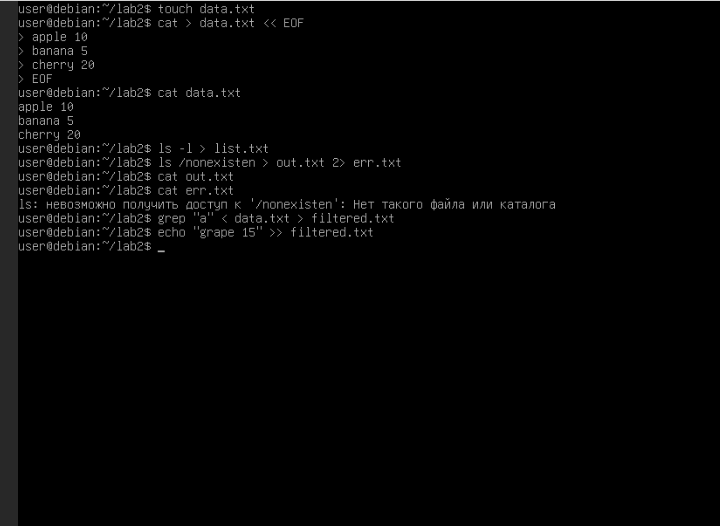

*Разбор:* Команда `ls /nonexistent > out.txt 2> err.txt` направила ошибку в err.txt, а out.txt остался пустым, так как успешного вывода не было.

*Пояснение:* Убедился что текущая оболочка - bash. создал рабочую директорию lab2 в домашнем каталоге и перешел в неё.

 *Пояснение2:* С помощью встроенного документа `<< EOF` перенаправил ввод из терминала в файл `data.txt`.

#### Раздел 2.3. Работа с интерпретаторами (sh, zsh, fish)
Проверено переключение между оболочками и разница в их синтаксисе.

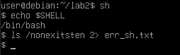
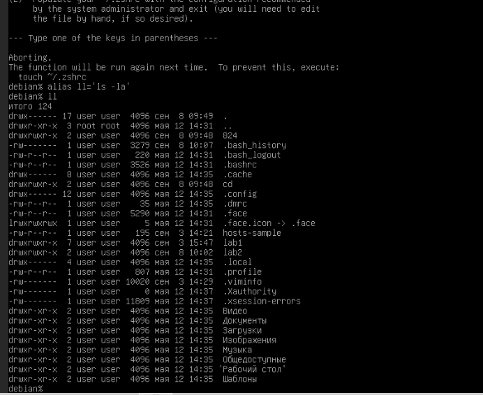
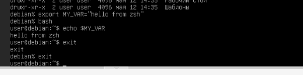
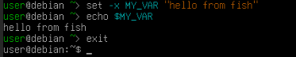

*Вывод:* В отличие от bash и zsh, в fish не используется знак "=" при создании алиасов и переменных. Переменные там задаются через `set -x`.

*Пояснение:* Переключился в оболочку sh. Проверил синтаксис перенаправления (конструкция `&>` здесь не поддерживается, нужно использовать`2>`).

*Пояснение:* Синтаксис fish кардинально отличается от `bash/zsh`: при объявлении алиасов и переменных знак `=` не используется. Переменные объявляются через конструкцию `set -x`.

#### Раздел 2.4. Конвейеры и условные операторы
Проверена работа операторов `;`, `&&`, `||` и построены цепочки команд.

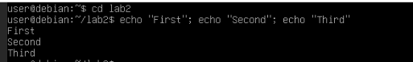

*Пояснение:* Все три команды выполнились по очереди независимо от результата предыдущих.

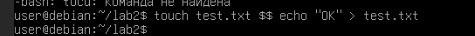

*Пояснение:* Строка "OK" записалась в файл, так как первая команда `touch` завершилась успешно.

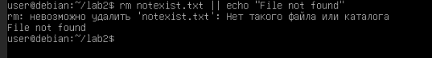

*Пояснение:* Так как файл `notexist.txt` не существует, первая команда вернула ошибку, что спровоцировало выполнение команды после `||`.

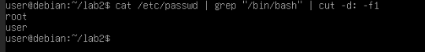

*Пояснение:* `cat` читает файл пользователей, `grep` фильтрует только строки с оболочкой `/bin/bash`, а `cut` вырезает первое поле (имена пользователей).
 
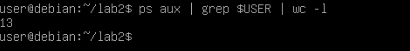

*Пояснение:* Конвейер выводит список всех процессов, фильтрует по текущему пользователю и считает строки. Итоговое число на 1 больше реального, так как сам процесс `grep` тоже попадает в этот список в момент выполнения.

#### Разделы 2.5 - 2.6. Создание алиасов
Настроены временные и постоянные алиасы в файле `.bashrc`.

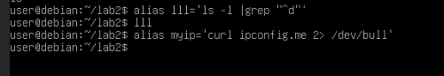
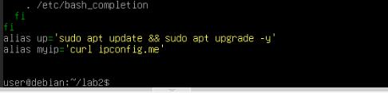
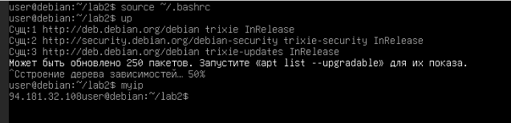
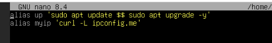
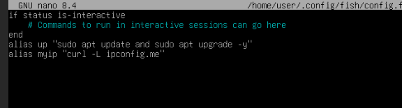

#### Разделы 2.7 - 2.8. Изучение пространств переменных
На практике проверена разница между локальной и глобальной переменной при запуске вложенного bash.

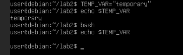
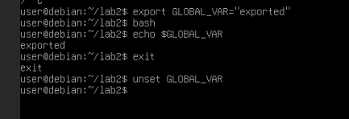
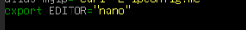
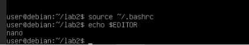
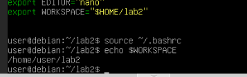

#### Раздел 2.9. Комплексный скрипт
Создан скрипт резервного копирования `lab2_script.sh` с проверкой аргументов и логированием.

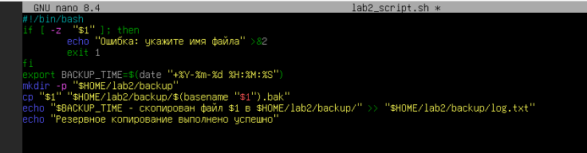
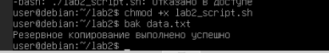

### 4. Ответы на контрольные вопросы

**4.1. Чем отличается перенаправление `>` от `>>`? Приведите пример.**
`>` перезаписывает файл целиком, а `>>` добавляет текст в конец. 
Пример: `echo "1" > f.txt` (запишет 1), `echo "2" >> f.txt` (допишет 2 на новой строке).

**4.2. В чем разница между `команда1 ; команда2` и `команда1 && команда2`?**
Через `;` вторая команда выполнится в любом случае. Через `&&` - только если первая завершилась успешно.

**4.3. Как объединить стандартные потоки stdout и stderr в один файл?**
С помощью конструкции `&>`: `команда &> file.txt`

**4.4. Что такое алиас? Как сделать его постоянным в bash, zsh, fish?**
Алиас - это короткий псевдоним для длинной команды. Чтобы сделать постоянным, нужно прописать его в конфигурационный файл: `~/.bashrc` (для bash), `~/.zshrc` (для zsh) или `~/.config/fish/config.fish` (для fish).

**4.5. Зачем нужно export перед переменной? Как сделать переменную окружения постоянной?**
`export` делает переменную глобальной, чтобы ее видели дочерние процессы (скрипты и программы). Чтобы она стала постоянной, ее нужно записать в `~/.bashrc`.

**4.6. Какая команда позволяет посмотреть все текущие переменные окружения?**
Команда `env` или `printenv`.

**4.7. Как передать вывод одной команды на ввод другой? Приведите пример.**
С помощью конвейера `|`. Пример: `ls -l | grep "data"`

**4.8. Назовите основные отличия fish от bash в синтаксисе алиасов и переменных.**
В fish не используется знак "=". Алиас пишется как `alias имя 'команда'`, а переменная - через `set -x ИМЯ значение`. Вместо `&&` пишется слово `and`.

**4.9. Как в одном процессе перенаправить stdin из файла и одновременно stdout в другой файл?**
`команда < input.txt > output.txt`

### 5. Вывод
В ходе работы изучены механизмы перенаправления потоков и работы конвейеров в Linux. Протестированы различия в синтаксисе оболочек, освоено создание алиасов и глобальных переменных, а также написан и отлажен bash-скрипт резервного копирования.
